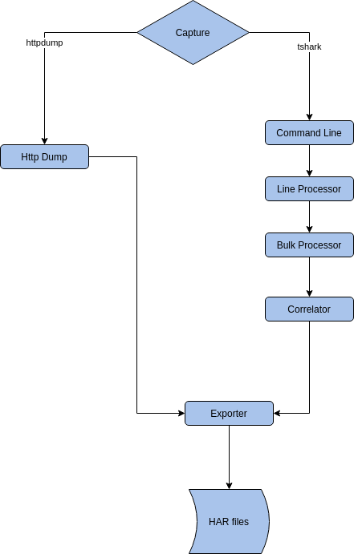

# HttShark

## Overview

HttShark is an application that captures packets from a network interface, 
collects and correlates HTTP requests and HTTP responses, 
and produces HAR files containing the HTTP transactions.

## Architecture

The application architecture is as follows:



The application can be configured to use one of the following capture engines:
* tshark 
* httpdump

### tshark capture engine
Using tshark as the capture engine executes the tshark command line to capture http packets.
For example, the following command line is executed:
```bash
sudo tshark -i eth0 \
    -f 'tcp port 80' \
    -d 'tcp.port==80,http' \
    -Y http \
    -T json \
    -e frame.time_epoch \
    -e tcp.stream \
    -e http.request \
    -e http.request.method \
    -e http.request.version \  
    -e http.request.uri.path \
    -e http.request.uri.query \
    -e http.request.line \
    -e http.file_data \
    -e http.response \
    -e http.response.version \
    -e http.response.code \
    -e http.response.line
```

The tshark command line arguments configure it to capture HTTP packets on a specific network interface,
and to output specific list of flags in a JSON format.

An example of such output is:

```json
  {
    "_index": "packets-2020-04-06",
    "_type": "pcap_file",
    "_score": null,
    "_source": {
      "layers": {
        "frame.time_epoch": ["1586165861.751442868"],
        "tcp.stream": ["0"],
        "http.request": ["1"],
        "http.request.method": ["GET"],
        "http.request.version": ["HTTP\/1.1"],
        "http.request.line": ["Host: example.com\r\n","User-Agent: curl\/7.58.0\r\n","Accept: *\/*\r\n"]
      }
    }
  }
```

A sequence of processors is run to produce har entries from the tshark STDOUT.
* ***Line Processor*** - 
collects line by line from the STDOUT, and detects JSON entry start and stop.
Once a JSON entry is located, it is sent to the next processor.
* ***Bulk Processor*** - 
parses a JSON entry, and converts it to a proprietary 
HTTP request and HTTP response structures.
These structures are sent to the next processor.
* ***Correlator Processor*** -
keeps in memory map of TCP stream ID to HTTP request.
Once a related TCP stream ID response is received,
it creates an proprietary HTTP transaction structure, 
and sends it to the next processor.
In case an HTTP request did not encounter a matching HTTP response within a certain timeout,
it is sent as a transaction without a response. 

Notice that the tshark creates by default temporary files on the /tmp folder.
This means that its performance is somehow worse than the httpdump capture engine.
This also means that you should manually remove the files on the /tmp folder. 

### httpdump capture engine

The httpdump capture engine is an alternative for the HTTP dump.
It uses a mechanism based on the https://github.com/hsiafan/httpdump project.
This is based on google's gopacket project,
to capture TCP packets, and create HTTP transactions from it.

The httpdump sources were refactored to match only capture from a network interface
(The original sources were also capable of reading a pcap file).
In addition, a bug was fixed in the httpdump:

#### The httpdump bug
The main loop is getting stuck, 
as it tries to add a packet to a specific client-server-connection go-routine channel.
The channel is getting full, 
and the client-server-connection does not read anymore from the queue, 
hence the main loop is stuck, and the capture is no longer running.
Why does the client-server-connection no longer reads from the queue?
Actually, the httpdump creates two streams for each client-server-connection: 
Upstream (from the client to the server), and Downstream (from the server to the client).
The client-server-connection runs a loop:
•	read the request from the upstream
o	if EOF - quit
•	read the response from the downstream
o	if EOF – quit
•	repeat

In case a packet is lost, 
it might occur that the client-server-connection go routine might think that the request is complete, 
and then try to read the response.
But the client is still sending new packets on the upstream (for example in case of large request), filling it up.
Meanwhile the client-server-connection go routine is trying to read from the downstream, 
but no response is found there, and we’re stuck.

The fix is to read from each stream with a timeout of 5 seconds.
In case the timeout expires AND the other stream is full, 
we have a problem, and we report EOF on the current stream.
We also print a warning message to the log about this issue.


## Command Line Flags

### Logs related configuration
* -aggregated-log-interval=1m0s: print aggregated log messages interval
* -verbose=0: print verbose information. 0=nothing 5=all
* -limited-error-length=20: truncate long errors to this length

Use log snapshot to print a specific verbosity level messages to a file.
Instead of having a log file that keeps growing with thousands of messages, 
the log snapshot prints the X last messages to a file every Y seconds.
The file is deleted, and recreated every X seconds, so its size is bounded.

* -log-snapshot-amount=0: print snapshot of logs messages count
* -log-snapshot-file="snapshot.log": logs snapshot file name
* -log-snapshot-interval=0s: print log snapshot interval
* -log-snapshot-level=0: print snapshot of logs from verbosity level. 0=nothing 5=all

#### Capturing related configuration 
* -capture="tshark": capture engine to use, one of tshark,httpdump
* -channel-buffer=1: channel buffer size
 It configures the GO channel between the processors. 
 Using a higher value would allow one processor to provide several entries,
 while the next processor is still working on previous entries.
* -device="": interface to use sniffing for
* -hosts=":80": comma separated list of IP:port to sample e.g. 1.1.1.1:80,2.2.2.2:9090. To sample all hosts on port 9090, use :9090


These 2 arguments configure how to decide when does a request considered un-answered by a response.
* -response-check-interval=10s: check timed out responses interval
* -response-timeout=5m0s: timeout for waiting for response


These 2 arguments are related to the httpdump bug mentioned in the previous section.
* -network-stream-channel-size=1024: network stream channel size
* -network-stream-channel-timeout=5s: network stream go routine accept new packet timeout
 
#### Har processors configuration 
 
* -drop-content-type="image,audio,video": 
comma separated list of content type whose body should be removed (case in-sensitive, using include for match)
* -har-processors="file": comma separated processors of the har file. 
use any of file,sites-stats,transactions-sizes,sampled-transactions
* -stats-interval=10s: print stats exporter interval
* -split-by-host=true: split output files by the request host
 
***files processor configuration***
* -export-interval=10s: export HAL to processors interval
* -output-folder=".": har files output folder

***sites-stats processor configuration***
* -sites-stats-file="statistics.csv": sites statistics CSV file

***sampled-transactions processor configuration***
* -sample-transactions-rate=1: how many transactions should be sampled in each stats interval
* -sampled-transactions-folder="sampled": sampled transactions output folder

***transactions-sizes processor configuration***
* -requests-sizes-stats-file="requests_sizes.csv": requests sizes statistics CSV file
* -responses-sizes-stats-file="responses_sizes.csv": responses sizes statistics CSV file
